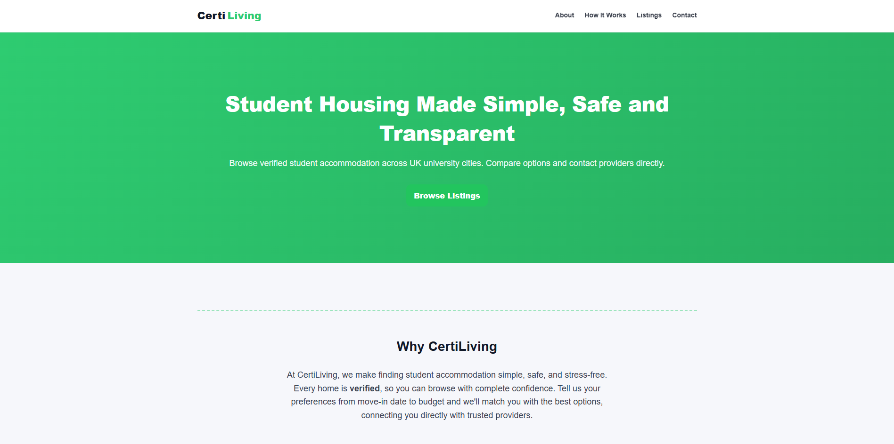
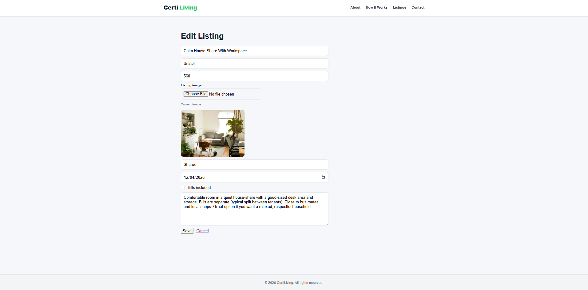

# CertiLiving Website

CertiLiving is a Flask full-stack website for browsing and managing verified student accommodation listings.
Live site: `https://certiliving.co.uk`

## Screenshots




<details>
  <summary>More screenshots</summary>

  
  
  

</details>

## What It Includes
- Public listings pages: featured, all listings, and listing detail
- Filtering, pagination, and similar listings
- Enquiry form with validation, CSRF protection, and email notification via Resend
- Admin dashboard for managing listings
- Image uploads to Cloudflare R2

## Tech Stack
- Python + Flask
- PostgreSQL (Supabase)
- Jinja templates + custom CSS
- Cloudflare R2 (S3-compatible) for images
- Resend for enquiry email delivery
- Render for website server hosting

## Quick Start
1. Install dependencies:
   ```bash
   pip install -r requirements.txt
   ```
2. Set environment variables (minimum for local run):
   - `SECRET_KEY`
   - `ADMIN_PASSWORD`
   - `DATABASE_URL`
3. Initialize database (if needed) and run:
   ```bash
   python run.py
   ```

## Environment Variables
- Core: `SECRET_KEY`, `ADMIN_PASSWORD`, `DATABASE_URL`
- Email: `RESEND_API_KEY`, `RESEND_FROM_EMAIL`, `ENQUIRY_TO_EMAIL`
- Storage: `R2_ACCOUNT_ID`, `R2_ACCESS_KEY_ID`, `R2_SECRET_ACCESS_KEY`, `R2_BUCKET`, `R2_PUBLIC_BASE_URL`

## Deployment
Use a WSGI server (e.g. `gunicorn`) and set all required environment variables in your hosting provider (e.g. Render).
